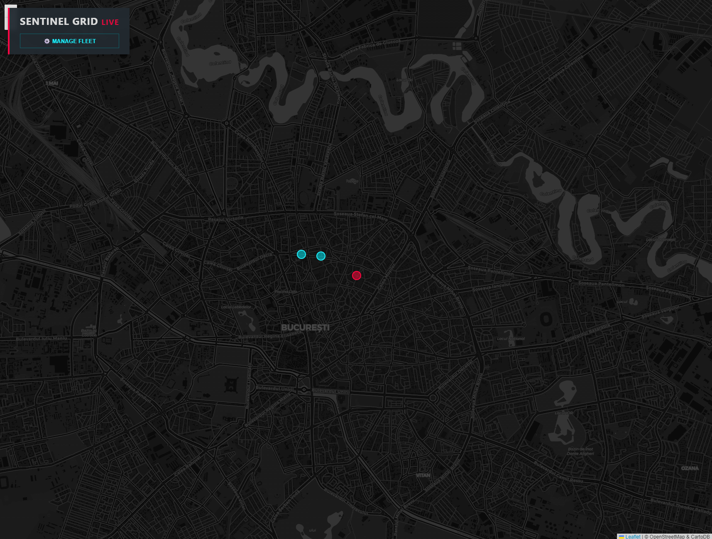
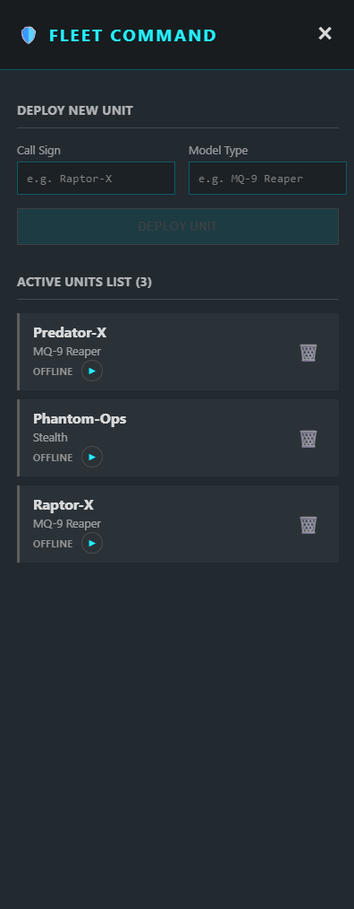
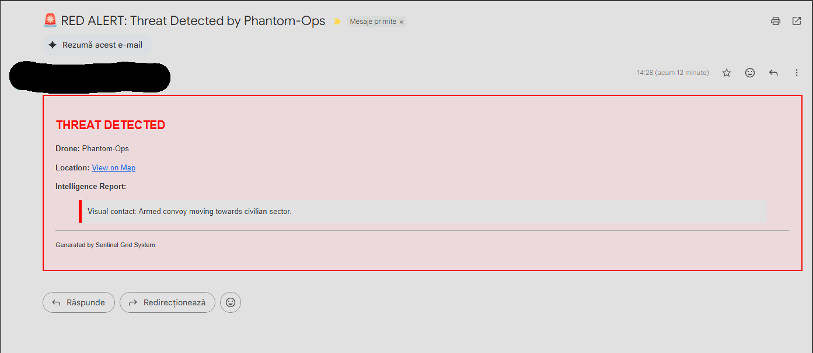

# 🛡️ Sentinel Grid - Autonomous Drone Surveillance System


**Sentinel Grid** is a full-stack, distributed surveillance system designed to manage autonomous drone fleets, analyze telemetry in real-time using Generative AI, and trigger strategic alerts for detected threats.

Built with a microservices architecture, it leverages **Quarkus** for high-performance backend processing, **Angular** for the tactical dashboard, and **Google Gemini 2.5 Flash** for intelligent threat analysis.

---

## 📸 System Previews

### 1. Tactical Dashboard (Real-time Tracking)


*Live tracking of drone assets. Red indicators signify active threats detected by AI.*

### 2. Fleet Command (Management & Simulation)


*CRUD operations for the drone fleet and "Autopilot" simulation controls.*

### 3. AI Intelligence & Alerting


*Automated email alerts triggered when Gemini AI identifies a high-risk situation.*

---

## 🏗️ System Architecture

The system follows a hybrid cloud architecture designed for low latency and high resilience:

1.  **Frontend (Angular Standalone):**
    * Serves as the Command & Control (C2) interface.
    * Visualizes telemetry on a **Leaflet.js** map.
    * Communicates with the Backend via REST API.
    * Listens to **Firebase Realtime Database** for live position updates.

2.  **Backend (Java Quarkus):**
    * Exposes REST endpoints for Fleet Management (CRUD) and Telemetry Ingestion.
    * Persists fleet inventory in **PostgreSQL (Neon DB)** via Hibernate/Panache.
    * **AI Integration:** Forwards unstructured drone reports to **Google Gemini 2.5 Flash**.
    * **Hot Storage:** Pushes processed telemetry to Firebase for instant frontend updates.

3.  **Alerting Layer:**
    * If Gemini verdicts a `THREAT`, the backend triggers a serverless Google Apps Script webhook to send "Red Alert" emails.

---

## 🚀 Tech Stack

### Backend & Infrastructure

* **Language:** Java 21
* **Framework:** Quarkus (Supersonic Subatomic Java)
* **Database:** PostgreSQL (managed by Neon.tech)
* **Real-time Store:** Firebase Realtime Database
* **Containerization:** Docker
* **Hosting:** Render.com (Cloud Deployment)

### Frontend

* **Framework:** Angular 18+ (Standalone Components)
* **Styling:** SCSS (Cyberpunk/Military aesthetic)
* **Mapping:** Leaflet.js + CartoDB Dark Matter tiles

### Artificial Intelligence

* **Model:** Google Gemini 2.5 Flash
* **Role:** Natural Language Processing (NLP) on drone field reports to determine threat levels (`SAFE`, `SUSPICIOUS`, `THREAT`).

---

## 🕹️ Features

* **Fleet Management (CRUD):** Deploy and decommission drones via a secured Admin Sidebar.
* **Autonomous Simulation:** "Play" mode for drones that generates GPS paths and randomized field reports (e.g., "Sector Clear" vs "Armed Convoy").
* **AI-Powered Analysis:** Drones don't just send coordinates; they send text reports. The system reads them and decides the threat level automatically.
* **Optimistic UI:** Instant visual feedback for fleet operations.
* **Resilient Connectivity:** CORS-configured, SSL-secured communication between distributed services.

---

## 🛠️ Installation & Setup

### Prerequisites

* Java 21+ & Maven
* Node.js 20+ & Angular CLI
* Docker (optional, for containerized run)

### 1. Backend Setup

```bash
cd backend
# Create a .env file with your keys:
# DATABASE_URL=jdbc:postgresql://...
# GOOGLE_AI_KEY=...
# FIREBASE_URL=...

./mvnw quarkus:dev
```

### 2. Frontend Setup

```bash
cd frontend
npm install
npm start
```

### 3. Running with Docker

```bash
docker build -f backend/src/main/docker/Dockerfile.jvm -t sentinel-api .
docker run -i --rm -p 8080:8080 sentinel-api
```

---

## 🎖️ Acknowledgments

This project demonstrates the integration of modern cloud-native Java with reactive frontend frameworks and Generative AI, simulating a defense-grade software solution.

**Status:** Mission Accomplished. 🛡️
