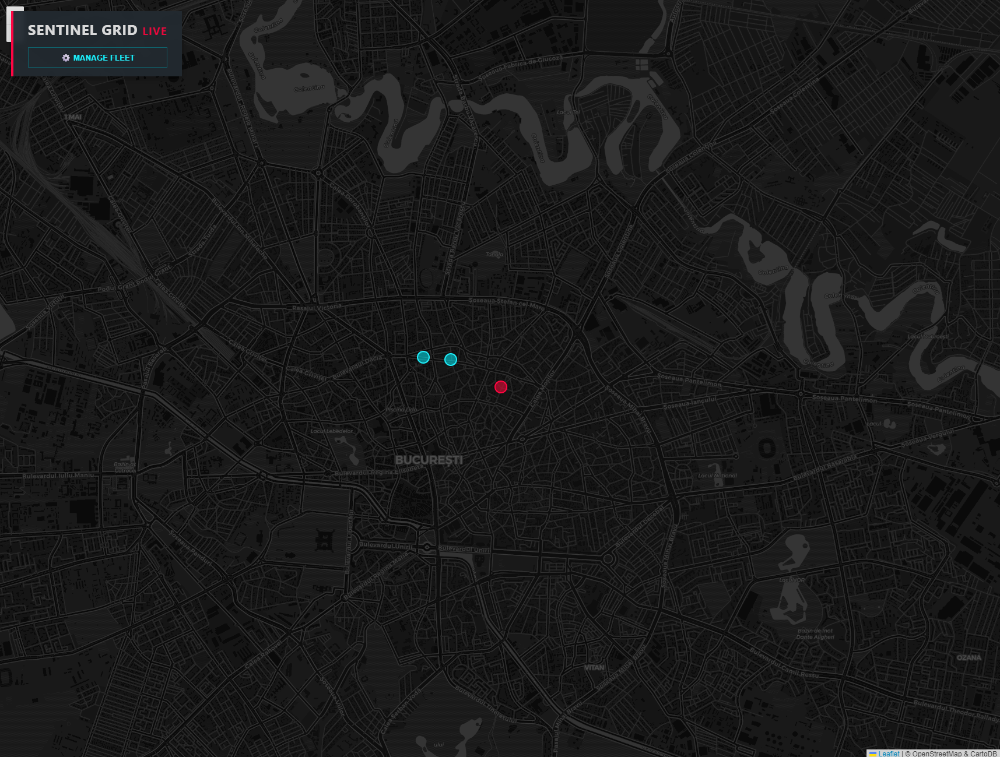
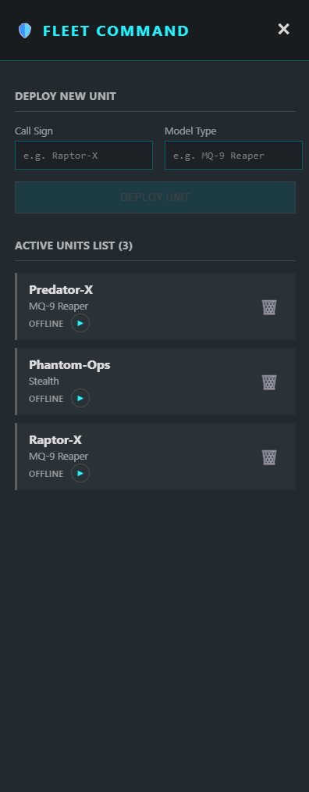
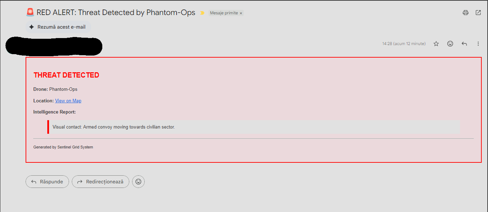
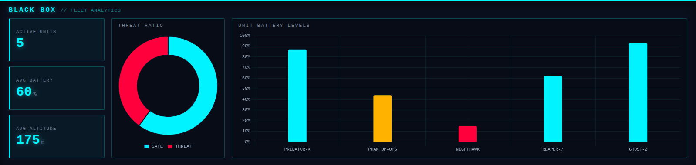
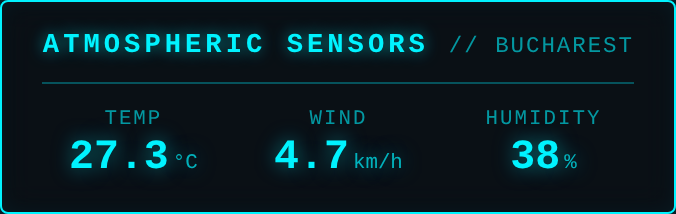
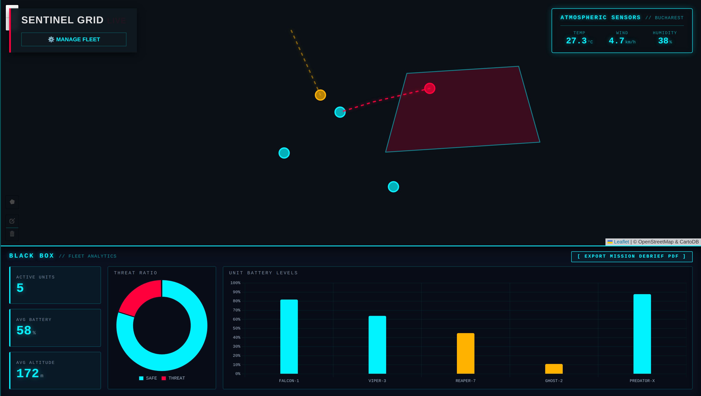

# 🛡️ Sentinel Grid - Autonomous Drone Surveillance System


**Sentinel Grid** is a full-stack, distributed surveillance system designed to manage autonomous drone fleets, analyze telemetry in real-time using Generative AI, and take autonomous tactical action — reinforcing threats and returning low-battery assets to base without an operator in the loop.

Built with a microservices architecture, it leverages **Quarkus** for high-performance backend processing, **Angular 21** (standalone, zoneless) for the tactical dashboard, and a **hybrid AI router** (local **Ollama** for dev, hosted **Groq** for prod) for intelligent threat analysis.

---

## 📸 System Previews

### 1. Tactical Dashboard (Real-time Tracking)


*Live tracking of drone assets over a WebSocket feed. Red indicators signify active threats detected by AI; amber indicators signify units in Autonomous Return-To-Base.*

### 2. Fleet Command (Management & Simulation)


*CRUD operations for the drone fleet and "Autopilot" simulation controls.*

### 3. AI Intelligence & Alerting


*Automated email alerts triggered when the AI identifies a high-risk situation.*

### 4. "Black Box" Fleet Analytics


*Real-time analytics panel beneath the map: SAFE vs THREAT ratio, per-unit battery levels (colour-graded, amber while a unit is in RTB), and live fleet stats. Exports a tactical debrief PDF on demand.*

### 5. Atmospheric Sensors


*Live weather HUD for the theatre of operations (Bucharest): temperature, wind speed, and humidity, sourced from Open-Meteo and cached server-side. Wind also feeds the drone energy-decay model.*

### 6. Autonomous Operations (Geofencing · Fleet Commander · RTB)


*The live tactical view showing the newer autonomous systems at once: a **No-Fly Zone** (red polygon), an **AI Fleet Commander** reinforcement route (red dashed — a SAFE unit vectored onto a THREAT contact), and an **Autonomous RTB** route (amber) for a critically-low unit returning to base.*

---

## 🏗️ System Architecture

The system follows a hybrid architecture designed for low latency, real-time reactivity, and autonomous decision-making:

1.  **Frontend (Angular 21 Standalone, Zoneless):**
    * Serves as the Command & Control (C2) interface.
    * Visualizes telemetry on a **Mapbox GL JS** 3D terrain map with altitude-aware markers and elevated flight paths.
    * Manages the fleet and simulation via REST API.
    * Streams live position, path, and status updates over a **native WebSocket** (`/ws/telemetry`).
    * Lets operators sketch and edit volumetric **No-Fly Zones** with per-zone AGL limits.

2.  **Backend (Java 21 / Quarkus):**
    * Exposes REST endpoints for Fleet Management (CRUD), Telemetry Ingestion, Navigation, Geofencing, and Analytics.
    * Persists fleet inventory in **PostgreSQL (Neon DB)** via Hibernate/Panache.
    * **Hybrid AI Router:** Forwards unstructured drone reports to either a **local Ollama** model or the **hosted Groq** API, selected per-environment via the `sentinel.ai.engine` property.
    * **Reactive Broadcast:** Fans out processed telemetry to all connected dashboards over a Jakarta **WebSocket** endpoint.
    * **Autonomous Agents:** Reroutes drones to reinforce detected threats (Fleet Commander) and to return home when battery is critical (RTB engine).
    * **Atmospheric Sensors:** Proxies live Bucharest weather from **Open-Meteo** through `/api/weather` with a server-side TTL cache (stale-on-error fallback).

3.  **Alerting Layer:**
    * If the AI verdicts a `THREAT`, the backend triggers a serverless Google Apps Script webhook to send "Red Alert" emails.

---

## 🚀 Tech Stack

### Backend & Infrastructure

* **Language:** Java 21
* **Framework:** Quarkus 3.30 (Supersonic Subatomic Java)
* **Database:** PostgreSQL (managed by Neon.tech), Hibernate ORM with Panache
* **Real-time:** Jakarta WebSockets (`quarkus-websockets`, `@ServerEndpoint`)
* **AI Clients:** MicroProfile REST Client (Ollama + Groq, OpenAI-compatible)
* **Weather Data:** Open-Meteo API (cached via `/api/weather`)
* **PDF Reporting:** OpenPDF (tactical mission debriefs)
* **Code Style:** Spotless (Google-style import ordering, unused-import removal)
* **Containerization:** Docker
* **Hosting:** Render.com (Cloud Deployment)

### Frontend

* **Framework:** Angular 21 (Standalone Components, Zoneless change detection)
* **Styling:** SCSS (Cyberpunk/Military aesthetic)
* **Mapping:** Mapbox GL JS 3, Terrain DEM, 3D building extrusions, and Mapbox Draw
* **Real-time:** RxJS `webSocket()` over `/ws/telemetry`
* **Analytics:** Chart.js + ng2-charts (real-time fleet charts)

### Artificial Intelligence

* **Engines:** Local **Ollama** (`gemma4:12b`) for development; hosted **Groq** (`llama-3.1-8b-instant`) for production.
* **Router:** Selected per-environment via `sentinel.ai.engine` (`ollama` in dev, `groq` in `%prod`).
* **Role:** Natural Language Processing (NLP) on drone field reports to determine threat levels (`SAFE`, `THREAT`).

---

## 🕹️ Features

### Core Surveillance

* **Fleet Management (CRUD):** Deploy and decommission drones via a secured Admin Sidebar.
* **Autonomous Simulation:** "Play" mode that generates GPS paths and randomized field reports (e.g., "Sector Clear" vs "Armed Convoy").
* **AI-Powered Analysis:** Drones send text reports, not just coordinates. A hybrid Ollama/Groq router reads them and assigns the threat level automatically.
* **Reactive Radar (Live Telemetry):** Position, path, and status updates stream to every connected dashboard over a native WebSocket (`/ws/telemetry`) — no polling, sub-second latency.
* **Red-Alert Emailing:** A `THREAT` verdict fires a serverless webhook that emails a tactical alert.

### Autonomous Tactics

* **Volumetric Geofencing & Pathfinding:** Operators sketch extruded **No-Fly Zones** with minimum/maximum AGL limits; the backend `NavigationService` checks complete 3D flight segments and computes safe horizontal detours.
* **AI Fleet Commander:** On a `THREAT` verdict, the closest available drone (chosen by Haversine distance, filtered by battery and threat state) is autonomously rerouted to reinforce the contact — rendered as a red, flowing reinforcement path.
* **Autonomous Emergency RTB:** A backend energy-decay engine drains battery from base load, speed, and live wind. When a unit drops below the critical threshold it is autonomously routed to the nearest base station (`status = RTB`), rendered as an amber flashing landing route, then lands and recharges.

### Intelligence & Reporting

* **"Black Box" Analytics:** A real-time panel below the map — a SAFE/THREAT doughnut, per-unit battery bars (amber while in RTB), and live stats — recomputed as telemetry streams in.
* **Mission Debrief (PDF):** One-click export of a cyber-styled tactical debrief PDF (OpenPDF), including a chronological log of every AI verdict from the session.
* **Atmospheric Sensors:** A live weather HUD (temperature, wind, humidity) for the operational theatre, pulled from Open-Meteo and cached server-side to neutralize rate limits.

### Platform & Delivery

* **Optimistic UI:** Instant visual feedback for fleet operations.
* **Resilient Connectivity:** CORS-configured, SSL-secured communication between distributed services.
* **CI/CD Guardrails ("Iron Gate"):** Husky + lint-staged pre-commit hooks (Spotless on the backend, ESLint/Prettier on the frontend) plus a GitHub Actions pipeline running parallel **Backend (Quarkus / Java 21)** and **Frontend (Angular 21)** builds, format checks, and tests on every PR to `main`.

---

## 🛰️ REST & WebSocket Surface

| Endpoint | Purpose |
| --- | --- |
| `GET  /api/drones` | List the fleet. |
| `POST /api/drones/{callSign}/ping` | Ingest a drone telemetry tick (drives AI, RTB, and broadcast). |
| `GET  /api/weather` | Cached Bucharest weather (Atmospheric Sensors). |
| `POST /api/navigation/route` | Compute a 3D `[lat,lng,altitude]` evasion route around active restricted volumes. |
| `GET / POST /api/geofences` | List and replace volumetric No-Fly Zones. |
| `GET  /api/analytics/export` | Export the Mission Debrief PDF. |
| `WS   /ws/telemetry` | Live position/path/status broadcast to dashboards. |

---

## 🛠️ Installation & Setup

### Prerequisites

* Java 21+ & Maven
* Node.js 20+ & Angular CLI
* Docker (optional, for containerized run)

### 1. Backend Setup

```bash
cd backend
# Create a .env file with your keys:
# DATABASE_URL=jdbc:postgresql://...
# FIREBASE_URL=...

# --- AI engine selection ---
# Dev defaults to local Ollama; pull the model and run it:
#   ollama pull gemma4:12b   (served at http://localhost:11434)
#   OLLAMA_API_URL=http://<host>:11434/api   (default: http://localhost:11434/api)
#   OLLAMA_MODEL=gemma4:12b
#
# Production (%prod) uses hosted Groq instead of local weights:
#   sentinel.ai.engine=groq
#   GROQ_API_KEY=<your-key>   (GROQ_API_URL defaults to https://api.groq.com/openai/v1)

./mvnw quarkus:dev
```

### 2. Frontend Setup

```bash
cd frontend
npm install
export MAPBOX_ACCESS_TOKEN=pk.your_url_restricted_public_token
npm start
```

On PowerShell, set the token with
`$env:MAPBOX_ACCESS_TOKEN="pk.your_url_restricted_public_token"` before `npm start`.
The token is written only to the ignored runtime configuration file and is not compiled into the
Angular bundle.

### 3. Running with Docker

```bash
docker build -f backend/Dockerfile -t sentinel-api backend
docker run -i --rm -p 8080:8080 sentinel-api
docker build -f frontend/Dockerfile -t sentinel-dashboard frontend
docker run -i --rm -p 4200:80 -e MAPBOX_ACCESS_TOKEN=pk.your_token sentinel-dashboard
```

### 4. Quality Gates (run before pushing)

```bash
# Backend: format-check + build + tests
cd backend && ./mvnw -B clean verify

# Frontend: build, lint, and tests
cd frontend && npm run build && npm run lint && npm run test:ci
```

---

## 🎖️ Acknowledgments

This project demonstrates the integration of modern cloud-native Java with a reactive, zoneless frontend and Generative AI — simulating a defense-grade software solution with autonomous tactical decision-making.

**Status:** Mission Accomplished. 🛡️
